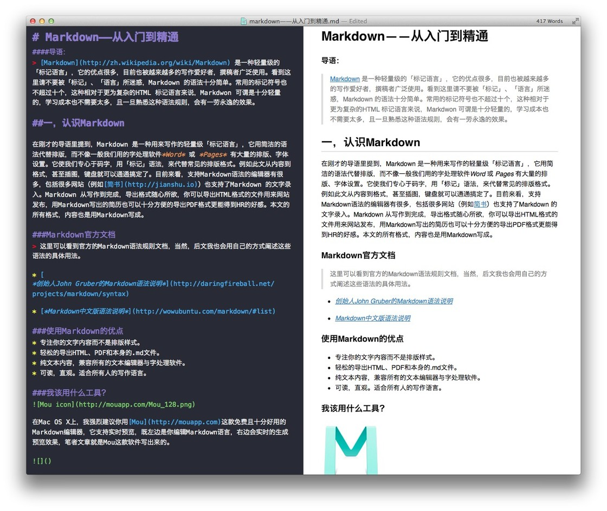
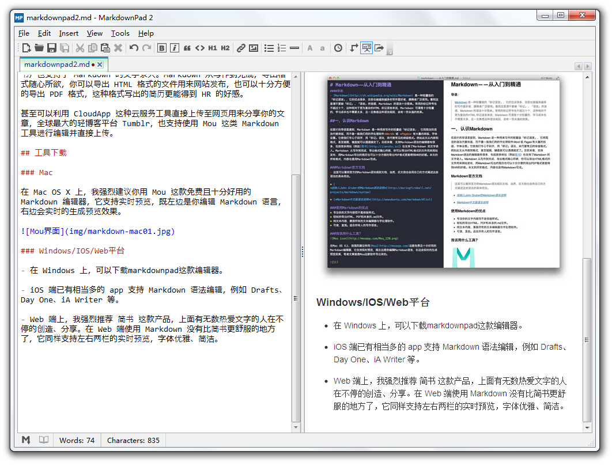

# markdown工具使用说明  
____

## markdown介绍

Markdown 是一种用来写作的轻量级「标记语言」，它用简洁的语法代替排版，而不像一般我们用的字处理软件 Word 或 Pages 有大量的排版、字体设置。  

它使我们专心于码字，用「标记」语法，来代替常见的排版格式。例如此文从内容到格式，甚至插图，键盘就可以通通搞定了。
  
目前来看，支持 Markdown 语法的编辑器有很多，包括很多网站（例如简书）也支持了 Markdown 的文字录入。Markdown 从写作到完成，导出格式随心所欲，你可以导出 HTML 格式的文件用来网站发布，也可以十分方便的导出 PDF 格式，这种格式写出的简历更能得到 HR 的好感。
  
甚至可以利用 CloudApp 这种云服务工具直接上传至网页用来分享你的文章，全球最大的轻博客平台 Tumblr，也支持使用 Mou 这类 Markdown 工具进行编辑并直接上传。  
  
## 工具下载

### Mac  

在 Mac OS X 上，我强烈建议你用 [Mou](http://25.io/mou/) 这款免费且十分好用的 Markdown 编辑器，它支持实时预览，既左边是你编辑 Markdown 语言，右边会实时的生成预览效果。

  
  
### Windows/IOS/Web平台  

- 在 Windows 上，可以下载[markdownpad](http://www.markdownpad.com/)这款编辑器。

- iOS 端已有相当多的 app 支持 Markdown 语法编辑，例如 Drafts、Day One、iA Writer 等。

- Web 端上，我强烈推荐 简书 这款产品，上面有无数热爱文字的人在不停的创造、分享。在 Web 端使用 Markdown 没有比简书更舒服的地方了，它同样支持左右两栏的实时预览，字体优雅、简洁。  

### 出处  
  
原文有更详细介绍，[点击查看](https://sspai.com/post/25137)。