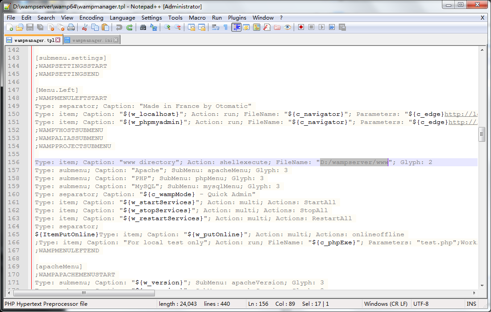
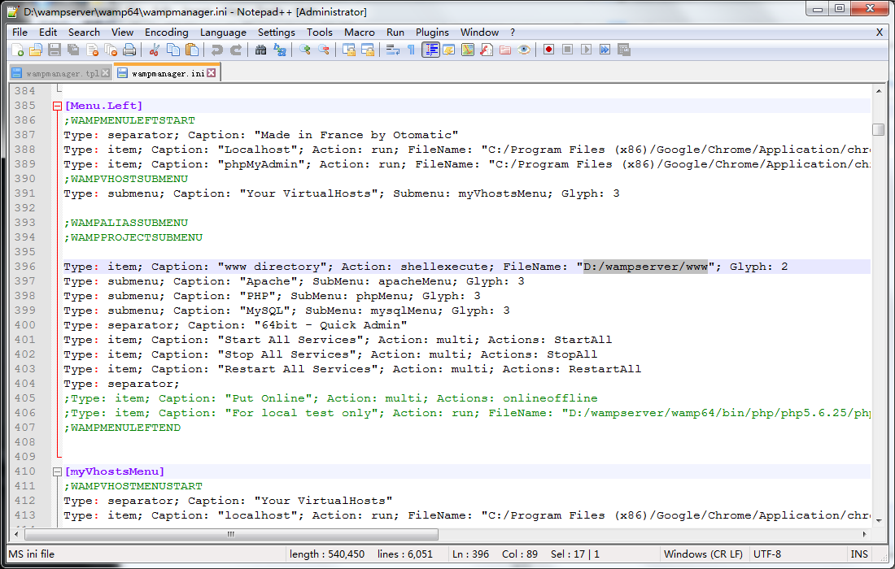
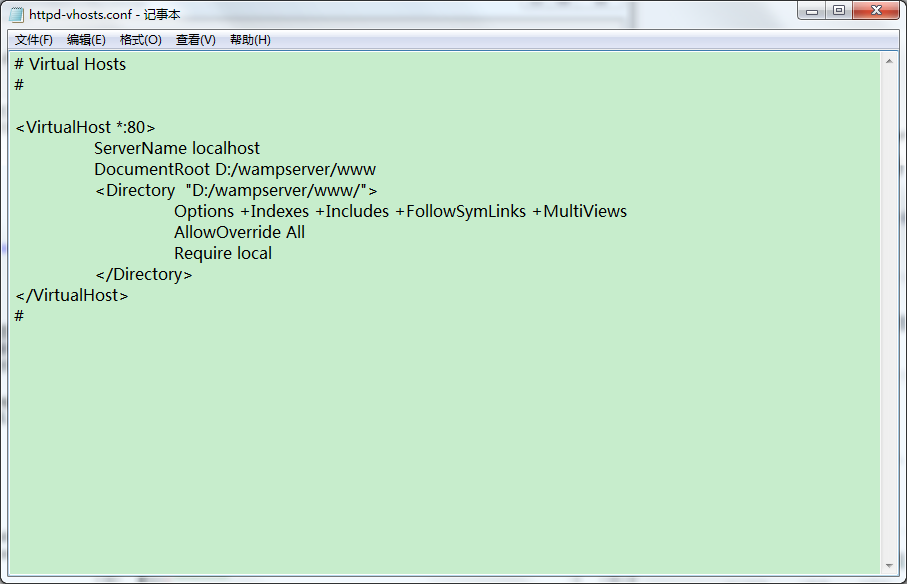
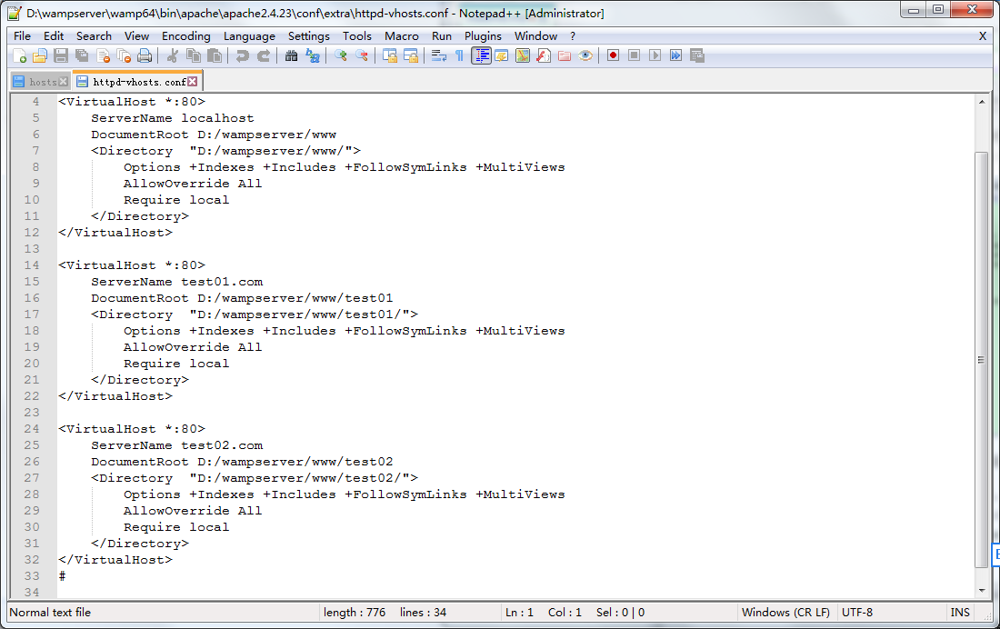
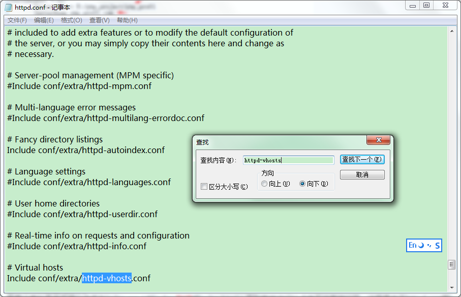
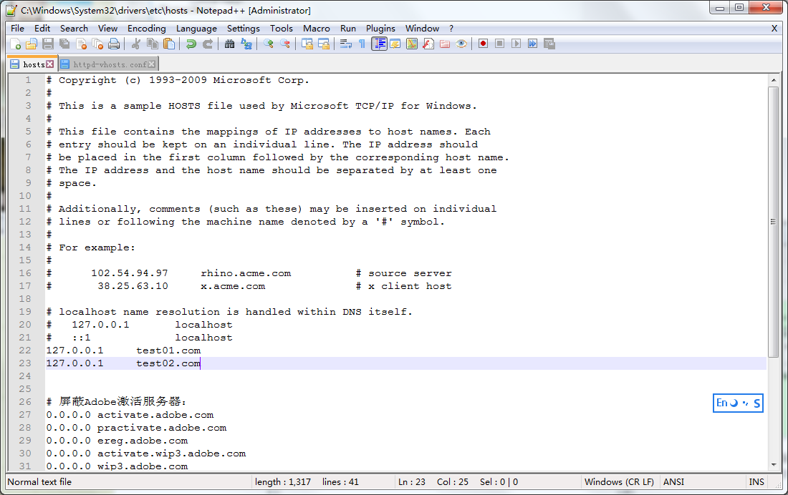

# wamp
___

## wamp简介

WAMP是Windows下的Apache+Mysql/MariaDB+Perl/PHP/Python，一组常用来搭建动态网站或者服务器的开源软件，本身都是各自独立的程序，但是因为常被放在一起使用，拥有了越来越高的兼容度，共同组成了一个强大的Web应用程序平台。

## wamp安装

 如何下载？
 
- 进入官网，选择操作系统直接[下载](http://www.wampserver.com/en/)

如何修改网站根目录？

- 系统的根目录分为两种，一种是wamp安装下自动索引的根目录，也就是wamp界面中www directory跳转目录，另一种就是apache服务器下的根目录，我们可以通过在浏览器中输入localhost:/filename进行索引(filename=文件名)。

- 第一种修改方式：进入wamp的根目录，分别修改wampmanager.ini和wampmanager.tpl，ctrl+f 分别搜索www directory字段，并找到如下两个文件代码。(修改完毕请务必关闭wamp进行重启，以下是修改后的界面截图)

- 第二种修改方式：在3.0.6版本后，进入到Apache中httpd-vhosts.conf文件，并且修改documentroot路径和directory路径。

如何配置多站点？

- 第一步，添加站点。进入wampserver下载目录打开http-vhosts.conf文件，并按如下图文添加站点信息。文件所在位置wampserver>>wamp64>>bin>>apache>>apache2.423>>conf>>extra>>https-vhosts.conf。

- 第二步，修改Apache中的httpd-conf配置文件，允许服务器多站点配置，也就是去掉httpd-vhosts前面的#号。在3.0.6版本中配置文件默认是允许的，所以可以省略这一步骤。

  

- 第三步，修改hosts中的域名配置。打开相应文件目录：C:>>Windows>>System32>>drivers>>etc>>hosts

站点配置完成后，退出重启，并在浏览器中输入test01.com或test02.com。

如何修改端口号？

- 打开Apache中的httpd.conf文件，ctrl+f搜索80端口，把搜索中的所有80端口修改成8080端口。

